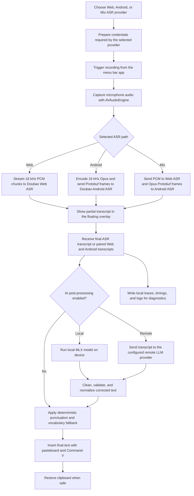

<div align="center">
  <br />
  
  <h1>Douvo</h1>
  <p>
    A lightweight macOS voice input app with Doubao ASR and optional AI post-processing.<br />
    Press a key, speak, clean up the transcript, and insert it into the app you are already using.
  </p>
  <p>
    <a href="./README.zh.md">中文</a>
    &nbsp;·&nbsp;
    <a href="./LICENSE">License</a>
    &nbsp;·&nbsp;
    <a href="./CONTRIBUTING.md">Contributing</a>
  </p>
  <br />
</div>

## Capabilities

<table>
  <tr>
    <td align="center">
      
      <br />
      <sub>Apply vocabulary hints</sub>
    </td>
    <td align="center">
      
      <br />
      <sub>Mixed Chinese/English without punctuation</sub>
    </td>
    <td align="center">
      
      <br />
      <sub>Reduce emotional wording</sub>
    </td>
  </tr>
  <tr>
    <td align="center">
      
      <br />
      <sub>Edit selected text</sub>
    </td>
    <td align="center">
      
      <br />
      <sub>Translate</sub>
    </td>
    <td align="center">
      
      <br />
      <sub>Switch appearance</sub>
    </td>
  </tr>
</table>

## Features

- 🎙️ **Dictate into any app** — Short press to toggle recording, or use hold-to-talk, then insert the result at the current cursor.
- 🧠 **Clean up before paste** — Optional AI post-processing can fix wording, punctuation, filler words, tone, and output style.
- ✍️ **Edit selected text by voice** — Select text, speak an edit instruction, and let AI rewrite the selected text instead of replacing it.
- 🌐 **Translate on demand** — Press a configurable translation key while recording and insert the result in your target language.
- 🗂️ **Use your own vocabulary and context** — Add project terms, paths, names, user identity, current time, frontmost app, and optional window title.
- ⚙️ **Choose local or remote AI** — Run MLX models on device, use a local model folder, or connect a remote LLM provider.
- 🪶 **Keep the workflow lightweight** — Menu bar UI, floating recording overlay, appearance switching, clipboard-aware insertion, and local diagnostics.

## Why Douvo

Douvo was built for mixed Chinese/English input workflows. In those scenarios, many mainstream local speech models still struggle with recognition quality, while Doubao IME has been much stronger in my day-to-day use, especially for mixed-language dictation.

The problem is that Doubao IME is still an input-method product:

- Voice input is tied to the active IME state, so it only works naturally when the input method is active.
- The recognized text is committed live while you speak, which makes it hard to switch apps or recover cleanly if the input is lost.
- If a long dictation is lost, you often have to dictate the whole thing again.
- Customization is limited: user vocabulary, rewrite behavior, translation, selection editing, and prompt-level controls are not the focus of the original IME.

Douvo keeps the strong Doubao ASR path, but wraps it as an app-agnostic voice input tool with post-processing, vocabulary, translation, selected-text editing, clipboard-aware insertion, and local diagnostics.

If you do not run into these pain points, the original Doubao IME is likely the better and simpler choice.

## Disclaimer

This project depends on observed Doubao web and IME client behavior. It is **not** an official Doubao API, SDK, or integration.

- You need a valid Doubao account and must log in yourself.
- Doubao may change its website, authentication flow, device registration, WebSocket protocols, ASR payload formats, rate limits, or access policy at any time.
- Audio sent for recognition is processed by Doubao's service. Review Doubao's own terms and privacy policy before using this app.
- Web login parameters and Android ASR credentials are stored locally so the selected provider can connect without keeping a browser window open.
- If remote AI post-processing is enabled, transcript text is sent to the provider and endpoint you configure.
- Local AI post-processing uses MLX models downloaded from Hugging Face or loaded from a local model folder.
- Use this project at your own risk. The maintainers are not responsible for service availability, account issues, data loss, policy violations, or other consequences.
- This project is not affiliated with, endorsed by, or sponsored by Doubao or ByteDance.

## How it works

Douvo supports three Doubao ASR paths: **Web**, **Android**, and **Mix**. The default is **Web**. The Android path follows observed Doubao IME client behavior, and Mix runs Web and Android together before merging the recognition results with AI post-processing. See **[ASR Providers](./docs/asr-providers.md)** for the protocol details.



## Requirements

- Apple Silicon Mac.
- macOS 14.0 or newer.

## Install

Recommended: download the latest **`douvo-<version>-macos.dmg`** from **[GitHub Releases](https://github.com/rhinoc/douvo/releases)**.

1. Open the DMG.
2. Drag **`Douvo.app`** onto the **Applications** shortcut.
3. Eject the disk image.
4. If macOS blocks first launch, trust the installed app once:

   ```bash
   xattr -dr com.apple.quarantine /Applications/Douvo.app
   open /Applications/Douvo.app
   ```

The DMG contains `Douvo.app` and an **Applications** shortcut only. Current release builds are not notarized, so macOS may ask you to confirm first launch or remove quarantine manually.

Homebrew is also available if you prefer tap-based installs:

```bash
brew install --cask rhinoc/tap/douvo
```

Homebrew Cask installs the same DMG artifact from GitHub Releases, not a separately signed package.

In-app updates are handled by Sparkle and use the same DMG artifact published on GitHub Releases.

### First launch and Gatekeeper

Browser and Homebrew downloads can be tagged with Gatekeeper **quarantine** (`com.apple.quarantine`). If macOS warns that Douvo cannot be opened or is from an unidentified developer, remove quarantine after copying or installing the app to **Applications**, then open it once.

```bash
xattr -dr com.apple.quarantine /Applications/Douvo.app
open /Applications/Douvo.app
```

## Permissions

macOS needs two permissions before the app can work end to end:

1. **Microphone** — required to capture speech.
2. **Accessibility** — required for the global trigger key and Command-V insertion.

If the trigger key does not work after granting Accessibility, quit and reopen the built `.app`. If macOS still ignores the trigger, remove the old Douvo entry from **System Settings -> Privacy & Security -> Accessibility**, add the current app bundle again, then restart the app.

Local AI post-processing runs on device. Remote AI post-processing sends transcript text to the configured remote provider and stores that provider's API key in Keychain.

## Usage

1. Open the menu bar item and choose **Log In**.
2. Complete Doubao login in the popup window.
3. Place your cursor in any text field.
4. Press the trigger key to start recording, or hold the hold-to-talk key if configured.
5. Speak.
6. Press the trigger key again, or release the hold-to-talk key, to stop and insert the transcript.
7. Press the translation key while recording to switch the current recording into translation mode.
8. Press **Escape** while recording to cancel.

Use **Settings...** from the menu bar to change trigger keys, choose a microphone, choose the ASR provider, refresh credentials, configure AI features, copy diagnostics, or open the app log.

### AI Post-processing

Open **Settings... -> Features** to configure punctuation, vocabulary, and AI-backed features. Open **Settings... -> AI** to configure AI post-processing:

- Choose **Local** to download a built-in MLX model or add a local MLX model folder.
- Choose **Remote** to add a provider, base URL, model name, and API key.
- Add vocabulary hints for project terms, file paths, product names, and common ASR mistakes.
- Choose output styles such as Natural, Concise, Structured, or Custom, and tune style strength.
- Configure a translation shortcut and target language.
- Configure optional context such as current time, frontmost app, and window title.
- Enable Selection Editing to use selected text as the edit target when AI post-processing is on. Selected text is capped at 500 characters.
- Tune punctuation, filler-word removal, emotion softening, and output style.
- Enable **Copy on Failure** to keep the generated text on the clipboard when the target app does not accept insertion.
- Use **Settings... -> Diagnose -> Debug Model** to test a sample input and inspect the local trace.

Advanced prompt overrides are available under **Settings... -> AI -> Advanced**. See [Advanced Prompts](./docs/advanced-prompts.md) for template variables and syntax.

## References

This project was built with reference to these open-source projects:

- [lilong7676/doubao-murmur](https://github.com/lilong7676/doubao-murmur)
  - WebView-based Doubao login.
  - Cookie and browser-identifier extraction for native ASR access.
  - Native WebSocket access to Doubao Web ASR.
  - 16 kHz PCM audio streaming and finish-frame behavior.
  - Menu bar voice-input interaction on macOS.
- [EvanDbg/doubao-ime-win](https://github.com/EvanDbg/doubao-ime-win)
  - Doubao IME Android client protocol reference.
  - Device registration and ASR token retrieval flow.
  - Protobuf-based ASR WebSocket task/session messages.
  - 16 kHz Opus audio framing for the Android IME ASR path.
- [Open-Less/openless](https://github.com/Open-Less/openless)
  - Product direction for app-agnostic voice input at the current cursor.
  - Menu bar / tray voice-input workflow.
  - Settings and diagnostics organization.
  - Text insertion reliability ideas, including paste fallback and clipboard restoration.
- [cjpais/Handy](https://github.com/cjpais/Handy)
  - Offline speech-to-text app architecture and recording pipeline reference.
  - Voice activity detection design with pre-roll, onset, and hangover smoothing.
  - Post-processing workflow ideas, including structured output and reasoning suppression.
  - Model, history, and diagnostics organization for a voice-input app.
- [kopiro/siriwave](https://github.com/kopiro/siriwave)
  - iOS 9 Siri-style waveform math and visual treatment for the recording overlay.

This repository does not vendor these projects. Their code and licenses remain owned by their respective authors.

## Contributing

Development setup, coding conventions, testing, credential-handling rules, and release notes live in **[CONTRIBUTING.md](./CONTRIBUTING.md)**.

## License

Douvo is released under the **MIT License**. See **[LICENSE](./LICENSE)**.
