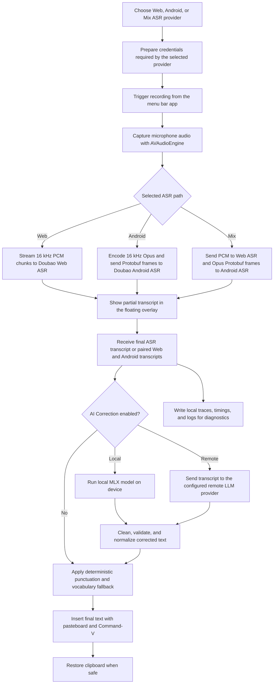

<div align="center">
  <br />
  
  <h1>Douvo</h1>
  <p>
    A lightweight macOS voice input app with Doubao ASR and optional AI correction.<br />
    Press a key, speak, clean up the transcript, and insert it into the app you are already using.
  </p>
  <p>
    <a href="./README.zh.md">中文</a>
    &nbsp;·&nbsp;
    <a href="./LICENSE">License</a>
    &nbsp;·&nbsp;
    <a href="./CONTRIBUTING.md">Contributing</a>
  </p>
  <br />
</div>

## Capabilities

<table>
  <tr>
    <td align="center">
      
      <br />
      <sub>Dictate into the current app</sub>
    </td>
    <td align="center">
      
      <br />
      <sub>Reduce emotional wording</sub>
    </td>
  </tr>
</table>

## Features

- 🎙️ **Dictate into any app** — Press one key, speak, and insert the transcript at the current cursor.
- 🧠 **Clean up before paste** — Optional AI correction can fix wording, punctuation, filler words, tone, and style.
- 🗂️ **Use your own vocabulary** — Add project terms, paths, names, and product words so corrections match your work.
- ⚙️ **Choose local or remote AI** — Run MLX models on device, use a local model folder, or connect a remote LLM provider.
- 🪶 **Keep the workflow lightweight** — Menu bar UI, floating recording overlay, clipboard-aware insertion, and local diagnostics.

## Disclaimer

This project depends on observed Doubao web and IME client behavior. It is **not** an official Doubao API, SDK, or integration.

- You need a valid Doubao account and must log in yourself.
- Doubao may change its website, authentication flow, device registration, WebSocket protocols, ASR payload formats, rate limits, or access policy at any time.
- Audio sent for recognition is processed by Doubao's service. Review Doubao's own terms and privacy policy before using this app.
- Web login parameters and Android ASR credentials are stored locally so the selected provider can connect without keeping a browser window open.
- If remote AI correction is enabled, transcript text is sent to the provider and endpoint you configure.
- Local AI correction uses MLX models downloaded from Hugging Face or loaded from a local model folder.
- Use this project at your own risk. The maintainers are not responsible for service availability, account issues, data loss, policy violations, or other consequences.
- This project is not affiliated with, endorsed by, or sponsored by Doubao or ByteDance.

## How it works

Douvo supports three Doubao ASR paths: **Web**, **Android**, and **Mix**. The default is **Web**. The Android path follows observed Doubao IME client behavior, and Mix runs Web and Android together before merging the recognition results with AI Correction. See **[ASR Providers](./docs/asr-providers.md)** for the protocol details.



## Requirements

- Apple Silicon Mac.
- macOS 14.0 or newer.

## Install

Recommended: download the latest **`douvo-<version>-macos.dmg`** from **[GitHub Releases](https://github.com/rhinoc/douvo/releases)**.

1. Open the DMG.
2. Drag **`Douvo.app`** onto the **Applications** shortcut.
3. Eject the disk image.
4. If macOS blocks first launch, trust the installed app once:

   ```bash
   xattr -dr com.apple.quarantine /Applications/Douvo.app
   open /Applications/Douvo.app
   ```

The DMG contains `Douvo.app` and an **Applications** shortcut only. Current release builds are not notarized, so macOS may ask you to confirm first launch or remove quarantine manually.

Homebrew is also available if you prefer tap-based installs:

```bash
brew install --cask rhinoc/tap/douvo
```

Homebrew Cask installs the same DMG artifact from GitHub Releases, not a separately signed package.

In-app updates are handled by Sparkle and use the same DMG artifact published on GitHub Releases.

### First launch and Gatekeeper

Browser and Homebrew downloads can be tagged with Gatekeeper **quarantine** (`com.apple.quarantine`). If macOS warns that Douvo cannot be opened or is from an unidentified developer, remove quarantine after copying or installing the app to **Applications**, then open it once.

```bash
xattr -dr com.apple.quarantine /Applications/Douvo.app
open /Applications/Douvo.app
```

## Permissions

macOS needs two permissions before the app can work end to end:

1. **Microphone** — required to capture speech.
2. **Accessibility** — required for the global trigger key and Command-V insertion.

If the trigger key does not work after granting Accessibility, quit and reopen the built `.app`. If macOS still ignores the trigger, remove the old Douvo entry from **System Settings -> Privacy & Security -> Accessibility**, add the current app bundle again, then restart the app.

Local AI correction runs on device. Remote AI correction sends transcript text to the configured remote provider and stores that provider's API key in Keychain.

## Usage

1. Open the menu bar item and choose **Log In**.
2. Complete Doubao login in the popup window.
3. Place your cursor in any text field.
4. Press the trigger key to start recording.
5. Speak.
6. Press the trigger key again to stop and insert the transcript.
7. Press **Escape** while recording to cancel.

Use **Settings...** from the menu bar to change the trigger key, choose a microphone, choose the ASR provider, refresh credentials, copy diagnostics, or open the app log.

### AI Correction

Open **Settings... -> Correction** to configure transcript post-processing:

- Choose **Local** to download a built-in MLX model or add a local MLX model folder.
- Choose **Remote** to add a provider, base URL, model name, and API key.
- Add vocabulary hints for project terms, file paths, product names, and common ASR mistakes.
- Tune punctuation, filler-word removal, emotion softening, and output style.
- Use Debug Model to test a sample input and inspect the local trace.

## References

This project was built with reference to these open-source projects:

- [lilong7676/doubao-murmur](https://github.com/lilong7676/doubao-murmur)
  - WebView-based Doubao login.
  - Cookie and browser-identifier extraction for native ASR access.
  - Native WebSocket access to Doubao Web ASR.
  - 16 kHz PCM audio streaming and finish-frame behavior.
  - Menu bar voice-input interaction on macOS.
- [EvanDbg/doubao-ime-win](https://github.com/EvanDbg/doubao-ime-win)
  - Doubao IME Android client protocol reference.
  - Device registration and ASR token retrieval flow.
  - Protobuf-based ASR WebSocket task/session messages.
  - 16 kHz Opus audio framing for the Android IME ASR path.
- [Open-Less/openless](https://github.com/Open-Less/openless)
  - Product direction for app-agnostic voice input at the current cursor.
  - Menu bar / tray voice-input workflow.
  - Settings and diagnostics organization.
  - Text insertion reliability ideas, including paste fallback and clipboard restoration.
- [cjpais/Handy](https://github.com/cjpais/Handy)
  - Offline speech-to-text app architecture and recording pipeline reference.
  - Voice activity detection design with pre-roll, onset, and hangover smoothing.
  - Post-processing workflow ideas, including structured output and reasoning suppression.
  - Model, history, and diagnostics organization for a voice-input app.

This repository does not vendor these projects. Their code and licenses remain owned by their respective authors.

## Contributing

Development setup, coding conventions, testing, credential-handling rules, and release notes live in **[CONTRIBUTING.md](./CONTRIBUTING.md)**.

## License

Douvo is released under the **MIT License**. See **[LICENSE](./LICENSE)**.
