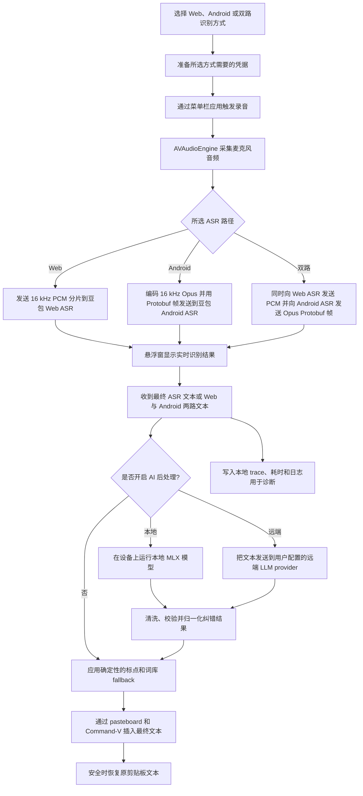

<div align="center">
  <br />
  
  <h1>Douvo</h1>
  <p>
    一个使用豆包 ASR，并可选大模型纠错的轻量 macOS 语音输入工具。<br />
    按一下快捷键，说话，整理转写结果，然后插入到你正在使用的应用里。
  </p>
  <p>
    <a href="./README.md">English</a>
    &nbsp;·&nbsp;
    <a href="./LICENSE">License</a>
    &nbsp;·&nbsp;
    <a href="./CONTRIBUTING.md">Contributing</a>
  </p>
  <br />
</div>

## 能力展示

<table>
  <tr>
    <td align="center">
      
      <br />
      <sub>按词库纠正术语</sub>
    </td>
    <td align="center">
      
      <br />
      <sub>中英文混合 + 去除标点</sub>
    </td>
    <td align="center">
      
      <br />
      <sub>弱化情绪化表达</sub>
    </td>
  </tr>
  <tr>
    <td align="center">
      
      <br />
      <sub>编辑选中文本</sub>
    </td>
    <td align="center">
      
      <br />
      <sub>翻译</sub>
    </td>
    <td align="center">
      
      <br />
      <sub>切换外观</sub>
    </td>
  </tr>
</table>

## 功能

- 🎙️ **在任何应用里输入** — 短按切换录音，或按住说话，然后把结果插入当前光标位置。
- 🧠 **插入前自动整理** — 可选 AI 后处理，处理错词、标点、去水词、语气和输出风格。
- ✍️ **用语音编辑选中文本** — 先选中文本，再说编辑指令，让 AI 改写选区，而不是直接替换选区。
- 🌐 **随时切换翻译** — 录音过程中按可配置的翻译键，把结果插入为目标语言。
- 🗂️ **使用自己的词库和上下文** — 添加项目术语、路径、名称、用户身份、当前时间、前台应用和可选窗口标题。
- ⚙️ **本地或远端 AI 可选** — 可在设备上运行 MLX 模型，也可以添加本地模型文件夹或远端 LLM provider。
- 🪶 **保持轻量工作流** — 菜单栏入口、录音悬浮窗、外观切换、剪贴板保护和本地诊断日志。

## 为什么做 Douvo

Douvo 主要是为中文环境里的中英混合输入场景做的。在这类场景下，很多主流本地语音模型的识别效果仍然不理想；而在我的日常使用里，豆包输入法在中英混合识别上明显更强。

问题在于，豆包输入法本质上仍然是一个输入法产品：

- 语音输入和 IME 状态强绑定，必须在输入法激活时才适合使用。
- 识别文本会实时上屏，输入期间很难自由切换应用。
- 一旦长段输入丢失，往往需要重新语音输入一遍。
- 定制能力有限：用户词库、改写规则、翻译、选区编辑和 prompt 级控制都不是原版输入法的重点。

Douvo 保留豆包 ASR 路径，但把它包装成一个不绑定具体应用的语音输入工具，并补上 AI 后处理、词库、翻译、选区编辑、剪贴板保护和本地诊断。

如果你没有这些痛点，建议直接使用原版豆包输入法，它会更简单。

## 免责声明

本项目依赖观察到的豆包 Web 和输入法客户端行为，**不是**豆包官方 API、SDK 或官方集成。

- 你需要拥有有效的豆包账号，并自行完成登录。
- 豆包可能随时调整网页、登录流程、设备注册、WebSocket 协议、ASR 数据格式、限流规则或访问策略。
- 语音识别由豆包服务端处理。使用前请自行确认豆包的服务条款和隐私政策。
- 应用会把 Web 登录参数和 Android ASR 凭据保存在本机，以便所选 provider 在不常驻浏览器窗口的情况下连接。
- 如果启用远端 AI 后处理，转写文本会发送到你配置的 provider 和 endpoint。
- 本地 AI 后处理使用从 Hugging Face 下载或从本地文件夹加载的 MLX 模型。
- 使用风险由使用者自行承担。维护者不对服务可用性、账号问题、数据损失、违反第三方规则或其他使用后果负责。
- 本项目与豆包或字节跳动没有从属、背书或赞助关系。

## 大概原理

Douvo 支持三种豆包 ASR 路径：**Web**、**Android** 和 **双路**。默认是 **Web**。Android 路径参考观察到的豆包输入法客户端行为；双路会同时运行 Web 和 Android，再用 AI 后处理合并两路识别结果。协议细节见 **[ASR Providers](./docs/asr-providers.md)**。



## 系统要求

- Apple Silicon Mac。
- macOS 14.0 或更新版本。

## 安装

推荐方式：从 **[GitHub Releases](https://github.com/rhinoc/douvo/releases)** 下载最新的 **`douvo-<version>-macos.dmg`**。

1. 打开 DMG。
2. 把 **`Douvo.app`** 拖到 **Applications** 快捷方式上。
3. 弹出磁盘镜像。
4. 如果 macOS 拦截首次启动，信任已安装的 app 一次：

   ```bash
   xattr -dr com.apple.quarantine /Applications/Douvo.app
   open /Applications/Douvo.app
   ```

DMG 里只有 `Douvo.app` 和 **Applications** 快捷方式。当前 release build 还没有 notarize，所以 macOS 首次启动时可能需要你手动确认，或移除 quarantine 标记。

如果你更习惯用 tap 管理应用，也可以使用 Homebrew：

```bash
brew install --cask rhinoc/tap/douvo
```

Homebrew Cask 安装的也是 GitHub Releases 上同一个 DMG，不是单独签名的安装包。

应用内自动更新由 Sparkle 处理，使用的也是 GitHub Releases 上发布的同一个 DMG 文件。

### 首次启动与 Gatekeeper

浏览器和 Homebrew 下载的应用都可能带有 Gatekeeper **quarantine** 标记（`com.apple.quarantine`）。如果 macOS 提示 Douvo 无法打开，或提示来自未识别开发者，请先把 app 安装到 **Applications**，然后移除 quarantine 标记并打开一次。

```bash
xattr -dr com.apple.quarantine /Applications/Douvo.app
open /Applications/Douvo.app
```

## 权限

完整使用前，需要授予两个 macOS 权限：

1. **麦克风** — 用来采集语音。
2. **辅助功能** — 用来监听全局触发键，以及向当前应用发送 Command-V。

如果授予辅助功能权限后触发键仍不可用，先退出并重新打开打包后的 `.app`。如果仍然无效，可以在 **系统设置 -> 隐私与安全性 -> 辅助功能** 中删除旧的 Douvo 项，再重新添加当前 app bundle，然后重启应用。

本地 AI 后处理在设备上运行。远端 AI 后处理会把转写文本发送到你配置的远端 provider，并把该 provider 的 API key 存在 Keychain。

## 使用方式

1. 点击菜单栏图标，选择 **Log In**。
2. 在弹出的窗口里完成豆包登录。
3. 把光标放到任意文本输入框。
4. 按触发键开始录音；如果配置了按住说话，也可以按住对应按键。
5. 说话。
6. 再按一次触发键，或松开按住说话按键，停止录音并插入文本。
7. 录音过程中按翻译键，可以把当前录音切换到翻译模式。
8. 录音过程中按 **Escape** 可以取消。

菜单栏里的 **Settings...** 可以修改触发键、选择麦克风、选择识别方式、刷新登录、配置 AI 功能、复制诊断信息或打开日志。

### AI 后处理

打开 **Settings... -> 功能** 配置标点、词库和依赖 AI 的功能。打开 **Settings... -> AI** 配置 AI 后处理：

- 选择 **Local** 下载内置 MLX 模型，或添加本地 MLX 模型文件夹。
- 选择 **Remote** 添加 provider、base URL、model name 和 API key。
- 添加用户词库，覆盖项目术语、文件路径、产品名称和常见 ASR 错词。
- 选择 Natural、Concise、Structured 或 Custom 等输出风格，并调整风格强度。
- 配置翻译快捷键和目标语言。
- 配置可选上下文，例如当前时间、前台应用和窗口标题。
- 开启选区编辑后，可在 AI 后处理开启时把选中文本作为语音指令的编辑对象。选中文本上限为 500 字。
- 配置标点、去水词、情绪弱化和输出风格。
- 开启 **Copy on Failure** 后，如果目标应用没有接受插入，会把生成结果留在剪贴板。
- 使用 **Settings... -> Diagnose -> Debug Model** 测试一段输入，并查看本地 trace。

高级 prompt override 位于 **Settings... -> AI -> Advanced**。模板变量和语法见 [高级 Prompt](./docs/advanced-prompts.zh.md)。

## 参考项目

本项目参考了以下开源项目：

- [lilong7676/doubao-murmur](https://github.com/lilong7676/doubao-murmur)
  - 基于 WebView 的豆包登录流程。
  - 提取豆包 cookies 和浏览器标识，用于原生 ASR 访问。
  - 通过原生 WebSocket 连接豆包 Web ASR。
  - 16 kHz PCM 音频流和结束帧行为。
  - macOS 菜单栏语音输入交互。
- [EvanDbg/doubao-ime-win](https://github.com/EvanDbg/doubao-ime-win)
  - 豆包输入法 Android 客户端协议参考。
  - 设备注册和 ASR token 获取流程。
  - 基于 Protobuf 的 ASR WebSocket task/session 消息。
  - Android 输入法 ASR 路径使用的 16 kHz Opus 音频分帧。
- [Open-Less/openless](https://github.com/Open-Less/openless)
  - 面向当前光标位置的全局语音输入产品方向。
  - 菜单栏 / 托盘式语音输入工作流。
  - Settings 与 Diagnose 的组织方式。
  - 文本插入可靠性思路，包括粘贴 fallback 和剪贴板恢复。
- [cjpais/Handy](https://github.com/cjpais/Handy)
  - 离线语音输入应用架构和录音管线参考。
  - 带 pre-roll、onset 和 hangover 平滑的 VAD 设计。
  - 后处理工作流思路，包括结构化输出和关闭 reasoning。
  - 语音输入应用中的模型、历史记录和诊断组织方式。
- [kopiro/siriwave](https://github.com/kopiro/siriwave)
  - 录音悬浮窗中 iOS 9 Siri 风格波形的数学和视觉参考。

本仓库没有 vendoring 这些项目。它们的代码和 license 仍归各自作者所有。

## Contributing

开发环境、代码风格、测试、凭据处理和发布说明都放在 **[CONTRIBUTING.md](./CONTRIBUTING.md)**。

## License

Douvo 使用 **MIT License** 发布。见 **[LICENSE](./LICENSE)**。
