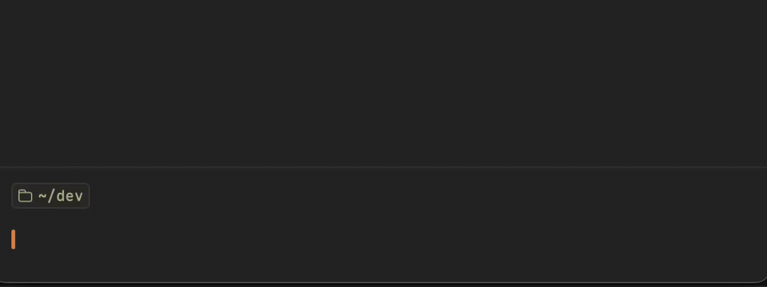

<div align="center">
  <br />
  
  <h1>Douvo</h1>
  <p>
    一个由豆包驱动的轻量 macOS 语音输入工具。<br />
    按一下快捷键，说话，然后把识别结果插入到你正在使用的应用里。
  </p>
  
  <p>
    <a href="./README.md">English</a>
    &nbsp;·&nbsp;
    <a href="./LICENSE">License</a>
    &nbsp;·&nbsp;
    <a href="./CONTRIBUTING.md">Contributing</a>
  </p>
  <br />
</div>

## 功能

- 🎙️ **在任何输入框说话** — 把光标放到文本框，触发录音，结束后自动插入最终识别文本。
- ⌨️ **单键触发** — 默认右 Option，也可以在 Settings 里改成其他单键。
- 🪶 **很小的菜单栏应用** — 没有复杂主窗口，只有菜单栏入口和录音时的紧凑悬浮窗。
- 🧩 **原生 macOS 链路** — `AVAudioEngine` 采音频，`URLSessionWebSocketTask` 处理 ASR 流，AppKit 承载菜单栏外壳。
- 🛠️ **实用 Settings** — Trigger Key、Microphone、Account、Diagnose、Log、About 放在一个设置面板里。
- 📋 **尽量不污染剪贴板** — 通过 pasteboard + Command-V 插入文本，并在安全时恢复原来的文本剪贴板内容。

## 免责声明

本项目依赖豆包 Web 产品的现有行为，**不是**豆包官方 API、SDK 或官方集成。

- 你需要拥有有效的豆包账号，并自行完成登录。
- 豆包可能随时调整网页、登录流程、WebSocket 协议、ASR 数据格式、限流规则或访问策略。
- 语音识别由豆包服务端处理。使用前请自行确认豆包的服务条款和隐私政策。
- 应用会把提取到的登录参数保存在本机，以便在不常驻浏览器窗口的情况下连接 ASR WebSocket。
- 使用风险由使用者自行承担。维护者不对服务可用性、账号问题、数据损失、违反第三方规则或其他使用后果负责。
- 本项目与豆包或字节跳动没有从属、背书或赞助关系。

## 大概原理

Douvo 使用豆包 Web 产品完成登录和语音识别，但应用本身尽量保持原生和轻量：

1. **登录**：用内嵌 `WKWebView` 打开 `https://www.doubao.com/chat`。
2. **提取本地凭据**：从 WebView session 中拿到豆包 cookies 和 ASR WebSocket 需要的浏览器标识。
3. **关闭 WebView**：登录完成后不需要长期保留浏览器窗口。
4. **流式发送音频**：麦克风音频转成 16 kHz PCM 分片，发送到豆包流式 ASR 服务。
5. **显示中间结果**：录音时在悬浮窗里展示实时识别文本。
6. **插入最终文本**：录音结束后把最终文本插入当前前台应用的输入框。

## 安装

使用 Homebrew：

```bash
brew tap rhinoc/douvo
brew install --cask douvo
```

Douvo 以 macOS DMG 形式发布。到 **[GitHub Releases](https://github.com/rhinoc/douvo/releases)** 下载最新的 **`douvo-<version>-macos.dmg`**。

1. 打开 DMG。
2. 把 **`Douvo.app`** 拖到 **Applications** 快捷方式上。
3. 弹出磁盘镜像，然后从 **Applications** 或 Spotlight 启动 **Douvo**。

DMG 里只有 `Douvo.app` 和 **Applications** 快捷方式。Homebrew Cask 安装的也是同一个 DMG 产物。

应用内自动更新由 Sparkle 处理，使用的也是 GitHub Releases 上发布的同一个 DMG 文件。

### 首次启动与 Gatekeeper

浏览器和 Homebrew 下载的应用都可能带有 Gatekeeper **quarantine** 标记（`com.apple.quarantine`）。如果 macOS 提示 Douvo 无法打开，或提示来自未识别开发者，请先把 app 安装到 **Applications**，然后移除 quarantine 标记。

移除已安装 app 的 quarantine 标记：

```bash
xattr -dr com.apple.quarantine /Applications/Douvo.app
```

### 本地构建

开发或本地测试时，可以自己打包：

```bash
./scripts/build-app.sh
open .build/release/Douvo.app
```

打包脚本会生成并签名本地 `.app`：

```text
.build/release/Douvo.app
```

开发环境、测试、PR 规则和发布边界请看 **[CONTRIBUTING.md](./CONTRIBUTING.md)**。

## 权限

完整使用前，需要授予两个 macOS 权限：

1. **麦克风** — 用来采集语音。
2. **辅助功能** — 用来监听全局触发键，以及向当前应用发送 Command-V。

如果授予辅助功能权限后触发键仍不可用，先退出并重新打开打包后的 `.app`。如果仍然无效，可以在 **系统设置 -> 隐私与安全性 -> 辅助功能** 中删除旧的 Douvo 项，再重新添加当前 app bundle，然后重启应用。

## 使用方式

1. 点击菜单栏图标，选择 **Log In**。
2. 在弹出的窗口里完成豆包登录。
3. 把光标放到任意文本输入框。
4. 按触发键开始录音。
5. 说话。
6. 再按一次触发键，停止录音并插入文本。
7. 录音过程中按 **Escape** 可以取消。

菜单栏里的 **Settings...** 可以修改触发键、选择麦克风、刷新登录凭据、复制诊断信息或打开日志。

## 参考项目

本项目参考了以下开源项目：

- [lilong7676/doubao-murmur](https://github.com/lilong7676/doubao-murmur)
  - 基于 WebView 的豆包登录流程。
  - 提取豆包 cookies 和浏览器标识，用于原生 ASR 访问。
  - 通过原生 WebSocket 连接豆包 Web ASR。
  - 16 kHz PCM 音频流和结束帧行为。
  - macOS 菜单栏语音输入交互。
- [Open-Less/openless](https://github.com/Open-Less/openless)
  - 面向当前光标位置的全局语音输入产品方向。
  - 菜单栏 / 托盘式语音输入工作流。
  - Settings 与 Diagnose 的组织方式。
  - 文本插入可靠性思路，包括粘贴 fallback 和剪贴板恢复。

本仓库没有 vendoring 这两个项目。它们的代码和 license 仍归各自作者所有。

## Contributing

开发环境、代码风格、测试、凭据处理和发布说明都放在 **[CONTRIBUTING.md](./CONTRIBUTING.md)**。

## License

Douvo 使用 **MIT License** 发布。见 **[LICENSE](./LICENSE)**。
